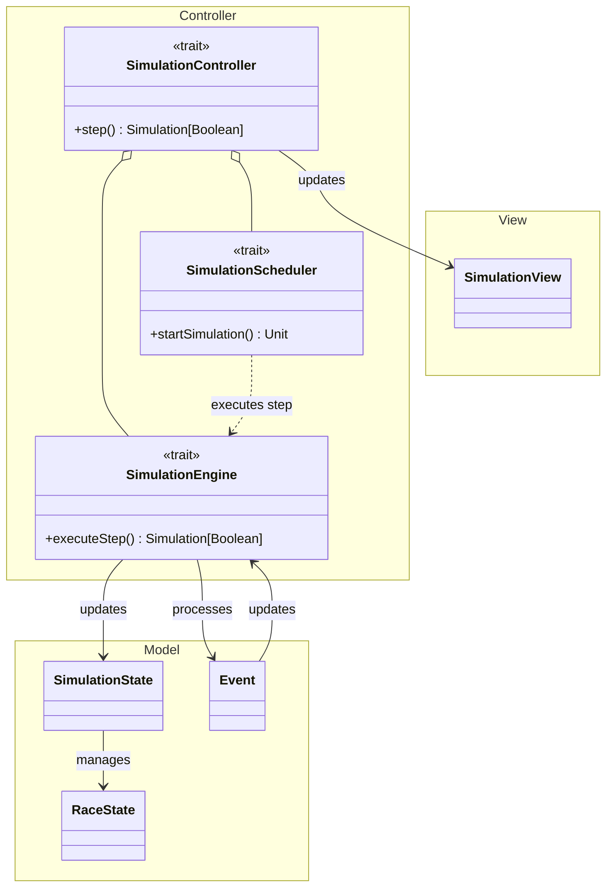

# Model-View-Controller Pattern

The main architecture of this simulation follows the MVC pattern. Beyond its simplicity, the intrinsic properties of
this pattern enabled clean and well-defined components. The domain model and the view are clearly distinguishable from
each other.

# Main Components

## Model

The main components of the model are the following:

- `SimulationState`: Abstractions for managing and transitioning simulation state.
- `RaceState`: Represents the entire state of the race simulation at a given time, including cars, events to be
  processed, weather and scoreboard.
- `Event`: Encapsulates race events such as lap completions, pit stops, weather changes, car progress along the track
  etc.

> **Disclaimer:** The design of the simulation core and engine was primarily inspired by Discrete Event Simulation (DES)
> principles.
> The concept of advancing the simulation state in discrete time intervals, driven by events, was the main drive of this
> project.
> However, it should be noted that this simulator is **NOT** a strict implementation of the DES paradigm,
> and therefore could easily diverge from it, especially when viewed from a purist perspective.

## View

`SimulationView`: Responsible but not limited to:
  - Visualizing the track.
  - Plotting cars.
  - Managing user input at the start of the program and during the simulation.
  - Visualising the scoreboard.

## Controller

The main controller components are:

- `SimulationController`: Orchestrates the race simulation, manages step execution.
- `SimulationScheduler`: Manages simulation timing, scheduling updates, and stepping through the simulation.
- `SimulationEngine`: Responsible for executing a single simulation step, along delegating the processing of events.

# Components interaction

As mentioned earlier, the simulation can be reduced to an evolution of `RaceState` over time.  
Below is a step-by-step breakdown of how a *single* simulation step is executed.

1. **Scheduler triggers the step**  
   The `SimulationScheduler` determines that it's time for the next step and initiates step execution.

2. **Controller delegates to engine**  
   The `SimulationController` acts as the central coordinator, delegating the actual work to `SimulationEngine`.

3. **Engine executes the step**

    - Updates the current `SimulationState` (a wrapper for `RaceState`).
    - Processes any pending `Event`s affecting the simulation flow (and schedules new ones, see [Detailed Design](../4_detailed_design/detailed_design.md)).

4. **View is updated**  
   The `SimulationView` is notified of the latest state and renders it for the user.

5. **Scheduler decides next step**  
   Based on the continue flag and user actions, the `SimulationScheduler` either:
   - Schedules the next step.
   - Stops the simulation.
