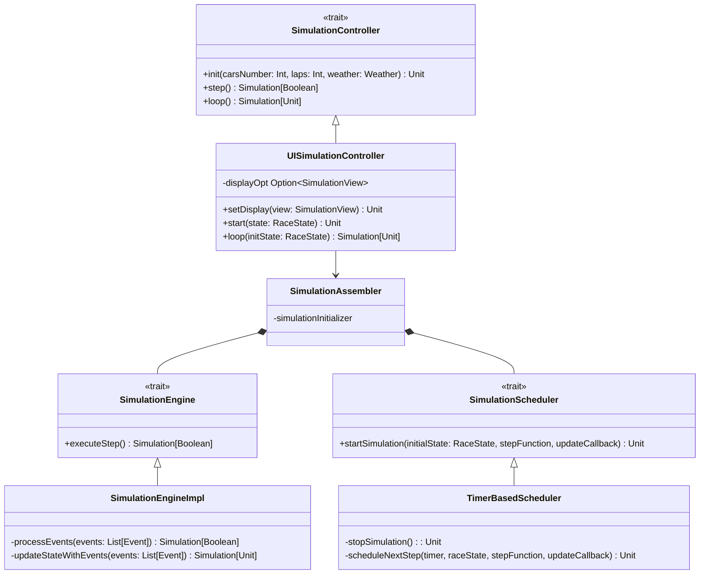

# Controller

This part was completely designed by Tiziano Vuksan.

## SimulationController

The `SimulationController` trait defines the high-level API for managing the simulation lifecycle.

More specifically:

- `init`: Sets up the simulation based on a given number of cars, number of laps, and weather
  conditions.
- `step`: Advances the simulation by exactly one logical step and returns a `Simulation[Boolean]`
  indicating if further steps are needed. The boolean allows the loop mechanism to know when to stop.
- `loop`: Executes the simulation repeatedly until completion. The method returns a `Simulation[Unit]`
  that represents the finished simulation state.

### UISimulationController

`UISimulationController` is the concrete, **UI-aware** implementation of `SimulationController`. It coordinates between
the simulation core and the presentation layer.

Responsibilities:

- **Starting the simulation**: Uses the `SimulationAssembler` to initialize entities and launch the simulation loop.
- **Simulation loop with UI updates**: Its loop variant that accepts a `RaceState` repeatedly:
    - Runs one simulation step using `runStep`
    - Passes the updated on for visual rendering
    - Delegates timing to the assembler’s scheduler

> NOTE: `UISimulationController` defines an overloaded variant of the `loop()` method from the interface

---

## SimulationScheduler

`SimulationScheduler` abstracts the **timing mechanism** for running simulations. It defines a single key method:

- **`startSimulation`**: Takes an initial `RaceState`, a `stepFunction` that computes the next state and whether to
  continue, and an `updateCallback` for reflecting changes externally (i.e in our case updating the UI).

The interface allows different scheduling strategies (fixed interval, variable timing, real-time) without changing the
simulation logic.

### TimerBasedScheduler

`TimerBasedScheduler` is a concrete scheduler that uses Java’s built-in `Timer` and `TimerTask` for fixed-interval
simulation execution.

It runs the step function every `x` milliseconds, with `x` being a positive amount of time.

It runs on the background on a separate thread **without affecting the main UI rendering thread**.

---

## SimulationEngine

`SimulationEngine` encapsulates the **core computational logic** of the simulation. It declares one method:

- **`executeStep`**: Advances the simulation by one logical time step. The result is a `Simulation[Boolean]` that
  indicates whether further steps are needed.

This trait isolates pure simulation logic from concerns like UI or scheduling.

### SimulationEngineImpl

`SimulationEngineImpl` is the concrete engine that manipulates simulation state according to defined rules.

This class is purely focused on simulation logic, without timing or UI logic.

For a more fine grained explanation see IMPLEMENTATION

---

## SimulationAssembler

`SimulationAssembler` is the **composition root** and dependency injection hub for the simulation system. It builds and
wires together all required components and exposes them through exported methods.

**Key responsibilities:**

- **Dependency creation**: Lazily instantiates:
    - `SimulationInitializer` – sets up initial simulation state
    - `SimulationEngine` - [See SimulationEngine](#simulationengine)
    - `SimulationScheduler`- [See SimulationScheduler](#simulationscheduler)
    - Event logging, scheduling, and processing components
    - `SimulationState` – [See SimulationState](../model/vuksan/simulation.md#simulationstate)
    - `Track` and `RacePhysics` – domain-specific parameters

The assembler is a single point where all major simulation dependencies are defined and managed, allowing other parts of the code to remain
focused on their own responsibilities..

---
