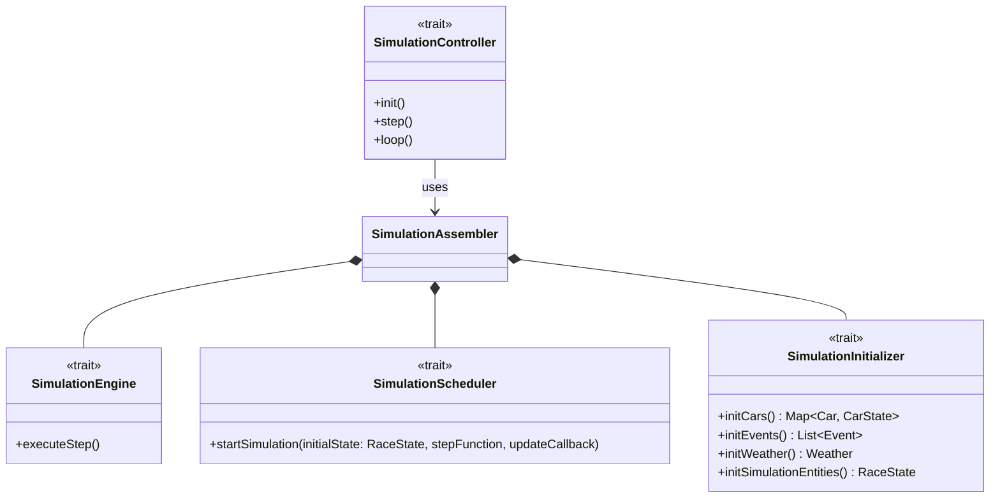

# Controller

This part was completely designed by Tiziano Vuksan.

## SimulationController

The `SimulationController` trait defines the high-level API for managing the simulation lifecycle.

More specifically:

- `init`: Sets up the simulation based on a given number of cars, number of laps, and weather
  conditions.
- `step`: Advances the simulation by exactly one logical step.
- `loop`: Executes the simulation repeatedly until completion.

---

## SimulationScheduler

`SimulationScheduler` abstracts the **timing mechanism** for running simulations. It defines a single key method:

- **`startSimulation`**: Takes an initial `RaceState`, a `stepFunction` that computes the next state and whether to
  continue, and an `updateCallback` for reflecting changes externally (i.e in our case updating the UI).

The interface allows different scheduling strategies (fixed interval, variable timing, real-time) without changing the
simulation logic.

---

## SimulationEngine

`SimulationEngine` encapsulates the **core computational logic** of the simulation. It declares one method:

- **`executeStep`**: Advances the simulation by one logical time step.
  This trait isolates pure simulation logic from concerns like UI or scheduling.

For more fine-grained details see [SimulationEngine](../../5_implementation/tiziano/sim_engine.md#simulationengineimpl).

---

## SimulationInitializer

`SimulationInitializer` is an abstract factory and aggregator responsible for creating all the main domain entities
needed to start a simulation, including the track, cars with their initial states, initial events, and starting weather.
It defines a clear contract without committing to a specific implementation, enabling different initialization
strategies (e.g., standard race, randomized setup, testing scenarios) while ensuring consistency of the initial
`RaceState`. From a design perspective, it follows the SRP principle, acts as a dependency injection
point for the simulation assembly process, and guarantees that the simulation core remains agnostic to how its starting
conditions are prepared.

---

## SimulationAssembler

`SimulationAssembler` is the **composition root** and dependency injection hub for the simulation system. It builds and
wires together all required components and exposes them through exported methods.

Key dependencies:

- `SimulationInitializer` – sets up initial simulation state
- `SimulationEngine` - [See SimulationEngine](#simulationengine)
- `SimulationScheduler`- [See SimulationScheduler](#simulationscheduler)
- `EventLogger`, `EventScheduler` - [See event processing and scheduling](../model/vuksan/eventpr_eventsch.md)
- `SimulationState` – [See SimulationState](../model/vuksan/simulation.md#simulationstate)
- `Track` and `RacePhysics` – domain-specific parameters

The assembler is a single point where all major simulation dependencies are defined and managed, allowing other parts of
the code to remain
focused on their own responsibilities..

---
