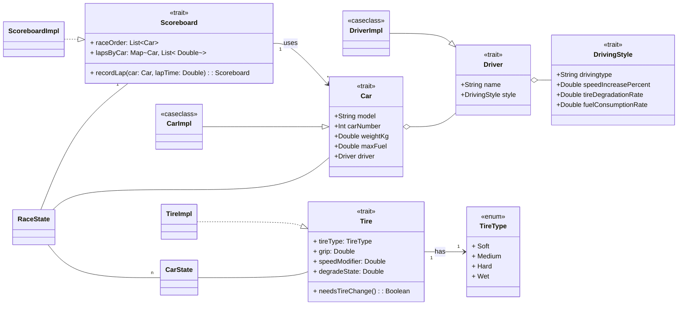

## Design Ines Fraccalvieri

# Simulation Modules Overview

### Car

Defines the representation of vehicles and their physical properties.

- **CarConstants** – Holds fixed parameters such as default car fuel capacity, minimum tire degradation, and maximum
  tire wear.
- **CarModule** – Contains immutable car information used to manage cars throughout the simulation.
- **TireModule** – Encapsulates tire-related properties, including speed modifiers, grip, tire type management, and
  degradation state. This will is in CarState, which holds all the mutable information of the car during the simulation.

### Driver

Models the driver component of the simulation.

- **DriverModule** – Defines driver attributes such as name and driving style.
- **DrivingStyleConstants** – Stores predefined values for different driving styles.
- **DrivingStyleModule** – Contains logic to apply driving styles to lap performance and race behavior.

### Race

Maintains race progression and results tracking.

- **ScoreboardModule** – Keeps track of race positions and lap times for each car. It supports recording lap times and
  dynamically updates race order based on completed laps and total lap times.

### Common

Provides data structures used across modules.

- **CoordinateModule** – Defines a 2D coordinate system representing points on the track. It is used in the view to draw
  the car and track.