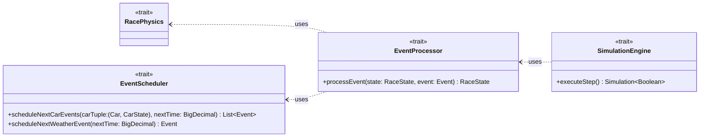

# Events processing and scheduling

---

## Event Processing

Events are processed in chronological order to maintain causality and realism. Each event encapsulates specific logic
that modifies the race state (see [Event types](./simulation.md#event-types))

Key processing steps include:

- **Car progress update:** Advances the car state using the physics engine and schedules subsequent events.
- **Sector transitions:** Updates the car’s current sector and triggers related events.
- **Lap completions:** Updates lap counts and adjusts the scoreboard.
- **Pit stops:** Reconditions tires and refuels the car.
- **Weather changes:** Updates weather conditions and schedules future weather events.

The processor leverages the `RacePhysics` trait to compute detailed state transitions, such as speed, fuel consumption,
and tire degradation.

---

## Event Scheduling

`EventScheduler` is responsible for dynamically generating and enqueuing future events based on the current race
state and environment.

Scheduling logic analyzes factors including:

- **Car conditions:** Fuel level, tire wear, and sector completion dictate whether a pit stop or sector transition event
  is required.
- **Race progress:** Regular updates on car positions are scheduled to maintain smooth state evolution.
- **Weather patterns:** Weather changes are scheduled at fixed intervals with randomized conditions to simulate
  real-world variability.

## Race Physics

See also [Race Physics](./physics.md)