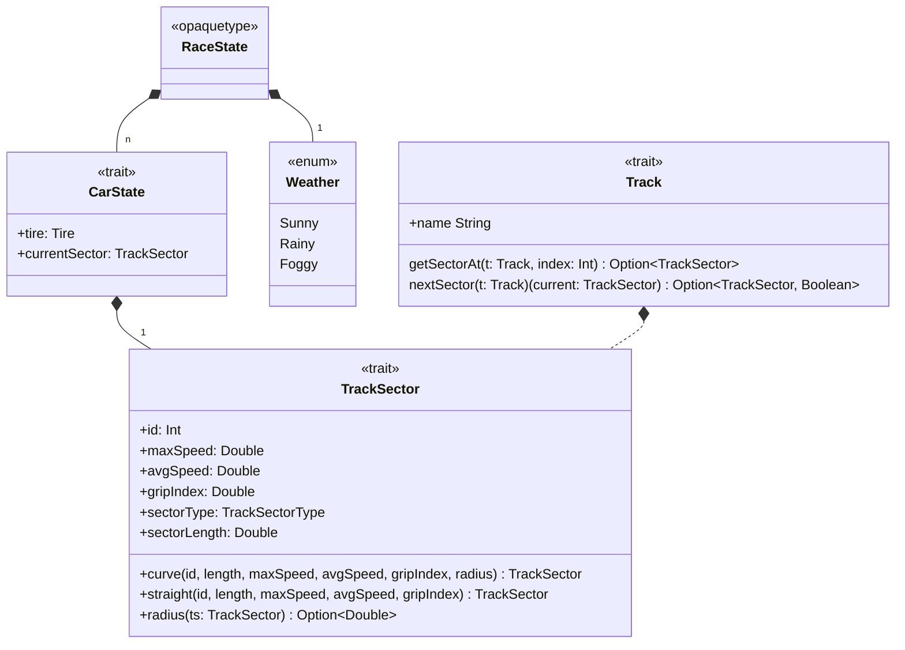

# Detailed design - Model Domain Entities

# Design Overview

## Track

`Track` is a trait representing a racing circuit composed of multiple sectors arranged in a defined sequence. It is
identified by a `name` and contains an internal structure of `TrackSector`s. The `Track` circuit is defined by the user
at the start of the program and passed along to the controller.

---

## TrackSector

`TrackSector` models a segment of a racing track with properties that describe its physical and driving characteristics,
such as:

- **sector length**: used to determine a `Car`'s progress along the sector at a given time.
- **grip level**: used to determine the grip factor
- **speed ranges** such as maximum speed, average speed.

All of these characteristics take part in the [RacePhysics](./physics.md) calculations.

Each sector is classified by its type, typically a **curve** or a **straight**.
Concrete instances of track sectors are created through factory methods, which ensure controlled and validated
construction, hiding implementation details from the public interface.

---

## Weather

`Weather` is an enumeration capturing the environmental conditions affecting the race. The available weather states
include

- `Sunny`
- `Rainy`
- `Foggy`

Each of these influences the racing dynamics by influencing the overall **grip factor**, which is also influenced by
`Tire` degradation and `TrackSector` own grip factor
The current weather is tracked within `RaceState` to allow simulation components to adjust behavior accordingly.
