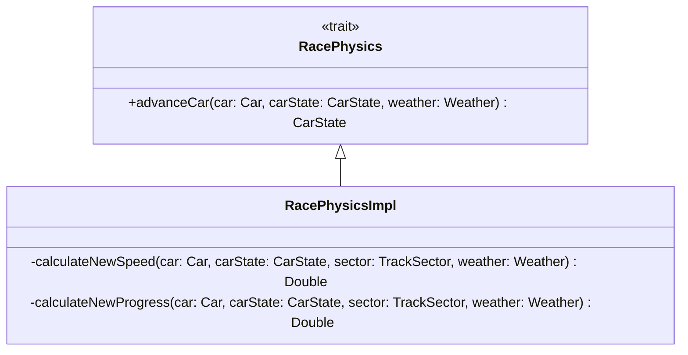

# Detailed design - Physics

## RacePhysics

The `RacePhysics` defines how a `CarState` should be updated based on the information it contains alongside the
information contained in`Car`.
`advanceCar()` makes sure:

- A new speed is calculated.
- Progress is made along the `currentSector` in which the car is traveling on.
- `Tire`s are degraded, fuel level is decreased.

In the case of the current implementation of `RacePhysics`, which was included in the diagram above to give more clarity, the calculations are simplified (if we compare them to
real world physics in which more factors are considered) and, as per
the [second system requirement](../../../2_requirement_specification/requirement_specification.md#32-system-requirements)
exclusively depend on:

- `DrivingStyle` speed increases.
- `Tire` degradation and grip factor.
- `Weather` affecting grip factor.
- `Car`'s weight.
- `TrackSector` grip factor.
  This ensures a realistic and nuanced simulation of car performance as it progresses through the different phases of a
  race.
