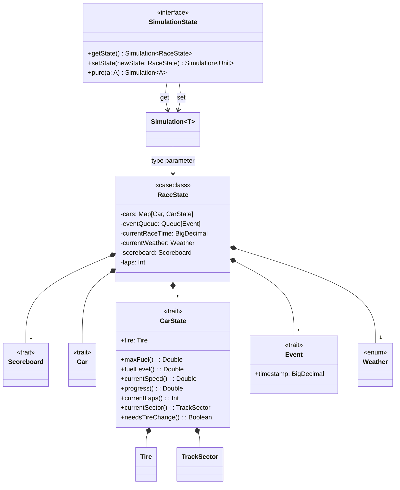

# Detailed design - Simulation

## States

### CarState

The `CarState` trait encapsulates all dynamic information about a car during the race simulation. It was **purposefully
**
separated from the `Car` trait as it contained static information, which does not evolve through time.
It tracks essential metrics including:

- Fuel levels.
- Current speed.
- Current progress, as a percentage along a track sector.
- Current track sector in which the car is.
- Tire mounted, they change based on weather.
- Current laps.

### RaceState

The `RaceState` entity serves as the central state container for the entire race simulation, and models the race
simulation
as if it was a snapshot of a simulation state at a given time.
More specifically it contains:

- A relationship between `Car`s and `CarStates`s as they are the same entity, but differ from the fact that one
  represent the car in a static way and the other in a dynamic one.
- An `Event` queue. Events are the fuel to the simulation evolution. They are constantly enqueued and dequeued. If the event queue is empty, the simulation ends.
- Current race time. Keeps count of the current logical time (which can be interpreted as _steps_).
- Current state of the `Scoreboard`.
- Current `Weather` condition.

## Events

`Event`s in the simulation system represent discrete occurrences that modify the race state at specific timestamps. The
`Event` trait provides a common interface for all race events, with the timestamp field ensuring proper chronological
ordering in the event queue. Events can represent various race occurrences such as pit stops or weather changes.

## Simulation

The `Simulation` type wraps `RaceState` into a monadic pattern, enabling functional composition of state
transformations. The `SimulationState` trait provides state management operations including:
- `getState()`: reading current state
- `setState()`: pdating state with new values
- `pure()`: creating pure computations that don't modify state
Each simulation step returns a `Simulation[T]` result, which can be combined with other operations through flatMap and map operations,
maintaining immutability and enabling easy testing of individual components.
