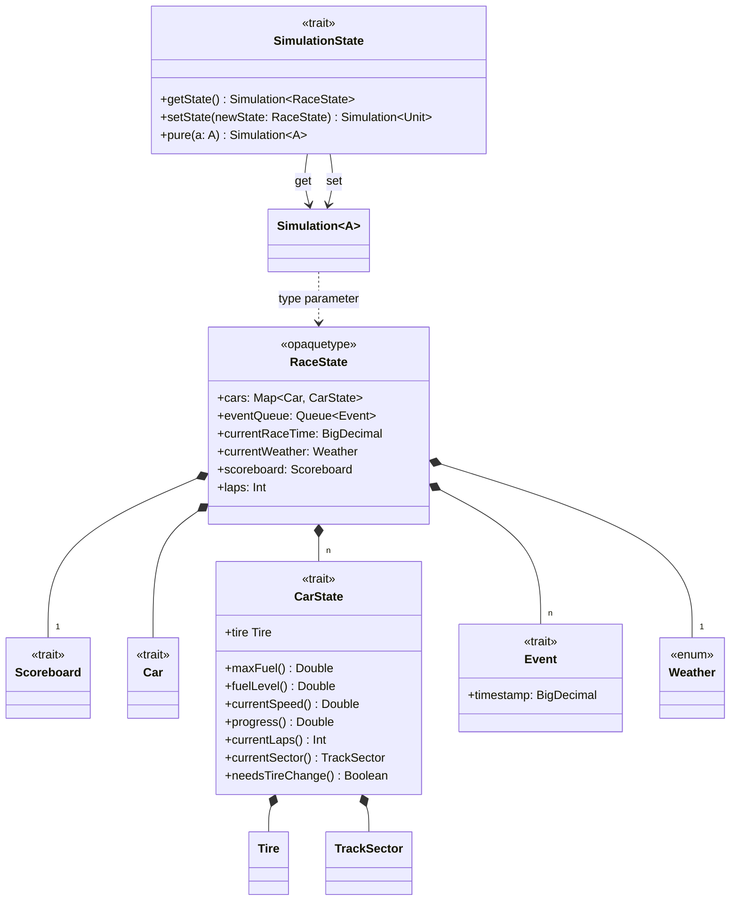

# Detailed design - Simulation

## States

### CarState

The `CarState` trait encapsulates all dynamic information about a car during the race simulation.
It was **purposefully** separated from the `Car` trait as it contained static information, which does not evolve through
time.
It tracks essential metrics including:

- Fuel levels.
- Current speed.
- Current progress, as a percentage along a track sector.
- Current track sector in which the car is.
- Tire mounted, they change based on weather.
- Current laps.

### RaceState

The `RaceState` entity serves as the central state container for the entire race simulation, and models the race
simulation as if it was a snapshot of a simulation state at a given time.
More specifically it contains:

- A relationship between `Car`s and `CarStates`s as they are the same entity, but differ from the fact that one
  represent the car in a static way and the other in a dynamic one.
- An `Event` queue. Events are the fuel to the simulation evolution. They are constantly enqueued and dequeued. If the
  event queue is empty, the simulation ends.
- Current race time. Keeps count of the current logical time (which can be interpreted as _steps_).
- Current state of the `Scoreboard`.
- Current `Weather` condition.

---

## Events

`Event`s in the simulation system represent discrete occurrences that modify the race state at specific timestamps. The
`Event` trait provides a common interface for all race events, with the timestamp field ensuring proper chronological
ordering in the event queue. Events can represent various race occurrences such as pit stops or weather changes.

### Event types

The simulation defines a hierarchy of event types, which represents all occurrences that
can affect the race state.

There are multiple specific event types tailored to different aspects of the race:

- **Car Events**: These events relate directly to individual cars and their interactions with the track.
  Examples include:
    - `TrackSectorEntered`: Triggered when a car enters a new sector of the track.
    - `PitStopRequest`: Represents a car requesting a pit stop for refueling or tire changes. The type of tires to be
      used are also affected by the current `Weather`.
    - `CarProgressUpdate`: Marks progress updates as the car moves along the track.
    - `CarCompletedLap`: Indicates that a car has completed a full lap of the circuit.

- **Weather Events**: These events represent changes in the race’s environmental conditions, such as:
    - `WeatherChanged`: Signifies a change in weather affecting the track and race dynamics.

---

## Simulation

The `Simulation` type wraps `RaceState` into a monadic pattern, enabling functional composition of state
transformations.

### SimulationState

The `SimulationState` trait provides state management operations including:

- `getState()`: reading current state.
- `setState()`: updating state with new values.
- `pure()`: creating pure computations that don't modify state.

  Each simulation step produces a `Simulation[T]` result maintaining immutability.
  
