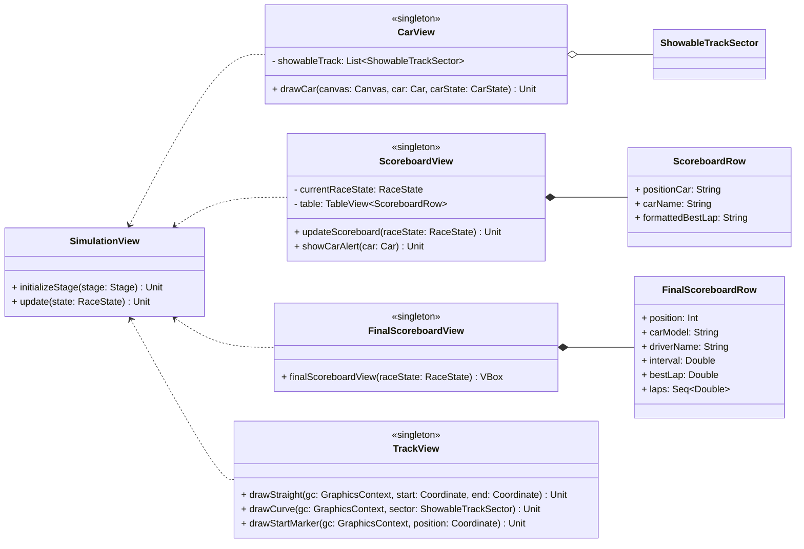

# Core View
This part was completely designed by Ines Fraccalvieri.

This part of the system focuses on **rendering the race simulation**, handling the drawing of track elements, cars, and live scoreboard updates.
## Components

### CarView

Renders cars on a JavaFX canvas during the race simulation. It manages:
- Assigning colors to cars based on their model. 
- Calculating and drawing car positions on the track, including interpolation for curved sectors.
- Drawing car numbers and driver initials the graphical car representation.

It depends on `ShowableTrackSector` objects to know the track geometry and sector types.

---

### ScoreboardView

Displays the live race standings in a table, showing car positions and intervals. It:
- Updates the view when new race state data arrives.
- Shows detailed car information in pop-up alerts on user interaction. 
- Keeps track of the current race state and uses `ScoreboardRow` entries for the table rows.

---

### FinalScoreboardView

Provides the final results UI, rendering a table of `FinalScoreboardRow` objects reflecting the race's concluding standings. It shows for each car:  position, car model, driver name, interval from leader, best lap and all lap times.

---

### TrackView
 
Responsible for drawing the race track on a JavaFX canvas, including straight and curved sectors, start markers, and visual track details. It manages display elements like the chequered flag image.

`ShowableTrackSector` represents individual track sectors with the start and end coordinates of the sector used by both `TrackView` and `CarView` for rendering and positioning.

This structured approach separates concerns clearly, allowing modular updates for the car display, race standings, track visualization, and overall simulation control.
