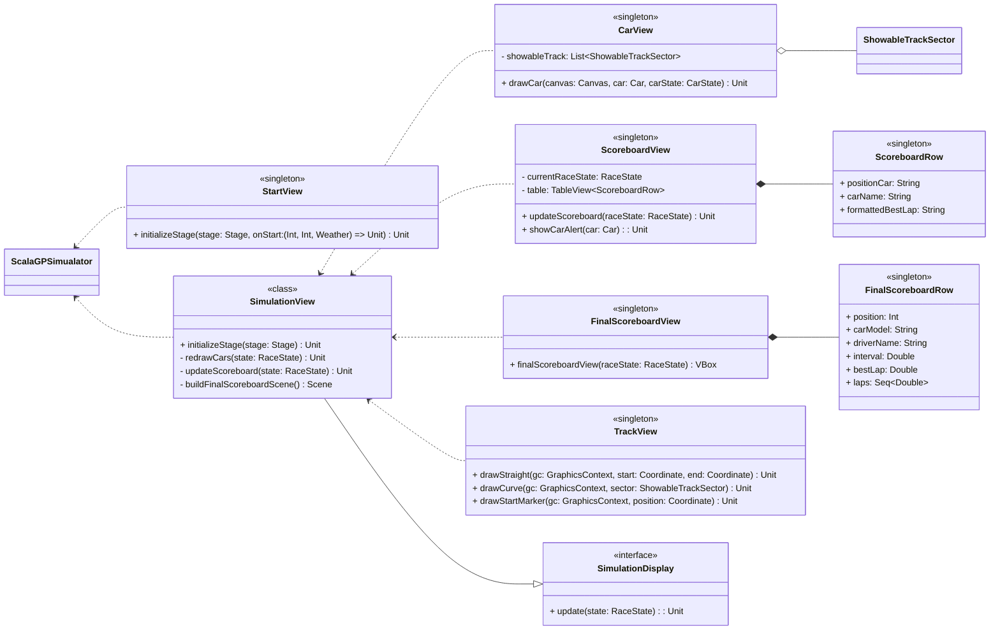

# View

# View Package Overview

This part was completely designed by Ines Fraccalvieri.

The **View** package is responsible for all user interface components within the racing simulation system. It is organized into submodules that separately handle cars, the race scoreboard, track visualization, and simulation control views.

### 1. Car

- **CarView (singleton)**  
  Responsible for rendering cars on a JavaFX canvas during the race simulation. It manages:
  - Assigning colors to cars based on their model.
  - Calculating and drawing car positions on the track, including interpolation for curved sectors.
  - Drawing car numbers and driver initials the graphical car representation.

  It depends on **ShowableTrackSector** objects to know the track geometry and sector types.

### 2. Scoreboard

- **ScoreboardView (singleton)**  
  Displays the live race standings in a table, showing car positions and intervals. It:
  - Updates the view when new race state data arrives.
  - Shows detailed car information in pop-up alerts on user interaction.
  - Keeps track of the current race state and uses **ScoreboardRow** entries for the table rows.

- **FinalScoreboardView (singleton)**  
  Provides the final results UI, rendering a table of **FinalScoreboardRow** objects reflecting the race's concluding standings. It shows for each car:  position, car model, driver name, interval from leader, best lap and all lap times.

### 3. Track

- **TrackView (singleton)**  
  Responsible for drawing the race track on a JavaFX canvas, including straight and curved sectors, start markers, and visual track details. It manages display elements like the chequered flag image.

- **ShowableTrackSector**  
  Represents individual track sectors with the start and end coordinates of the sector used by both **TrackView** and **CarView** for rendering and positioning.

### 4. Simulation

- **StartView (singleton)**  
  Handles the UI for initializing or starting the race simulation. Provides inputs for race parameters such as number of laps, drivers and weather conditions.

- **SimulationView (class)**  
  The core view controller that orchestrates the entire simulation UI. Responsibilities include:
  - Initializing the primary application stage.
  - Coordinating redraws of cars and updates to the scoreboard.
  - Building the final scoreboard scene.

  Implements **SimulationDisplay (interface)**, which defines an `update` method for receiving race state changes.

- **SimulationDisplay (interface)**  
  Declares the contract for any UI component that observes and updates based on simulation state changes.

  
This structured approach separates concerns clearly, allowing modular updates for the car display, race standings, track visualization, and overall simulation control.
