# View Initializer
This part was completely designed by Ines Fraccalvieri.

```mermaid
classDiagram
direction TB


%% Simulation package
class StartView {
    <<singleton>>
    + initializeStage(stage: Stage, onStart: (Int, Int, Weather) => Unit) Unit
}

class SimulationView {
    <<class>>
    + initializeStage(stage: Stage) Unit
    - initWeatherIcon() Unit
    - updateWeatherIcon(Weather) Unit
    - redrawCars(state: RaceState) Unit
    - configureStage(stage: Stage, scene: Scene) Unit
}

class SimulationDisplay {
    <<interface>>
    + update(state: RaceState) Unit
}

class SimulationViewInitializer {
    <<object>>
    + createSimulationView(track: Track, trackType: TrackType) SimulationView
}


class RaceStatusController {
     <<class>>
     - currentFinalRaceState: RaceState
     + updateLapLabel(state: RaceState) Unit
     + putChequeredFlag(state: RaceState) Unit
     + buildFinalScoreboardScene() Scene
}

ScalaGPSimualator <.. SimulationViewInitializer
ScalaGPSimualator <.. StartView
SimulationView --|> SimulationDisplay
SimulationViewInitializer ..> SimulationView : creates
SimulationView ..> RaceStatusController : uses
StartView ..> SimulationViewInitializer : uses

```

This part of the system focuses on **initializing, displaying, and controlling the simulation’s visual layer**.  
It forms the **entry point and presentation control layer** of the application.

---

### Flow of Control

Everything begins in **`ScalaGPSimulator`**, which extends **`JFXApp`** and serves as the entry point of the application.
- `ScalaGPSimulator` first **displays the `StartView`, allowing the user to choose simulation parameters (e.g., number of laps, cars, weather conditions).
- Once the user selects the parameters, `StartView` returns these values to `ScalaGPSimulator`, which then forwards them to `SimulationViewInitializer`. The initializer creates and configures a `SimulationView`, injecting all required dependencies to prepare the simulation for display.
- Finally, the `SimulationView` is shown, and the simulation loop begins, updating the view via the `SimulationDisplay` interface.

---

### Components

#### 1. StartView
- **Type:** Singleton class
- **Responsibility:** Displays the **initial simulation setup interface**.
- **Key Method:**
    - `initializeStage(stage: Stage, onStart: (Int, Int, Weather) => Unit)`
        - Prepares the starting screen.
        - Triggers the `onStart` callback with simulation parameters (laps, participants, weather).

---

#### 2. SimulationView
- **Type:** Class (implements `SimulationDisplay`)
- **Responsibilities:**
    - **Build & configure** the main simulation stage (`initializeStage`, `configureStage`).
    - Manage **visual elements**:
        - Weather icons (`initWeatherIcon`, `updateWeatherIcon`).
        - Car rendering (`redrawCars`).
    - Collaborate with `RaceStatusController` to **keep race information updated**.
- **Implements:** `SimulationDisplay` — enabling decoupled updates from the simulation logic.

---

#### 3. SimulationDisplay
- **Type:** Interface
- **Responsibility:** Defines a single method:
    - `update(state: RaceState)` — allows different simulation views to respond to state changes.
---

#### 4. SimulationViewInitializer
- **Type:** Object (factory)
- **Responsibility:**
    - Creates a **fully configured `SimulationView`** instance.
    - Injects dependencies (e.g., `RaceStatusController`).
    - Initializes UI elements like lap labels and buttons.
- **Advantage:** Removes magic numbers, centralizes setup logic.

---

#### 5. RaceStatusController
- **Type:** Class
- **Responsibilities:**
    - Updates **lap counter** (`updateLapLabel`).
    - Handles **chequered flag** display (`putChequeredFlag`).
    - Builds the **final scoreboard scene** (`buildFinalScoreboardScene`).
