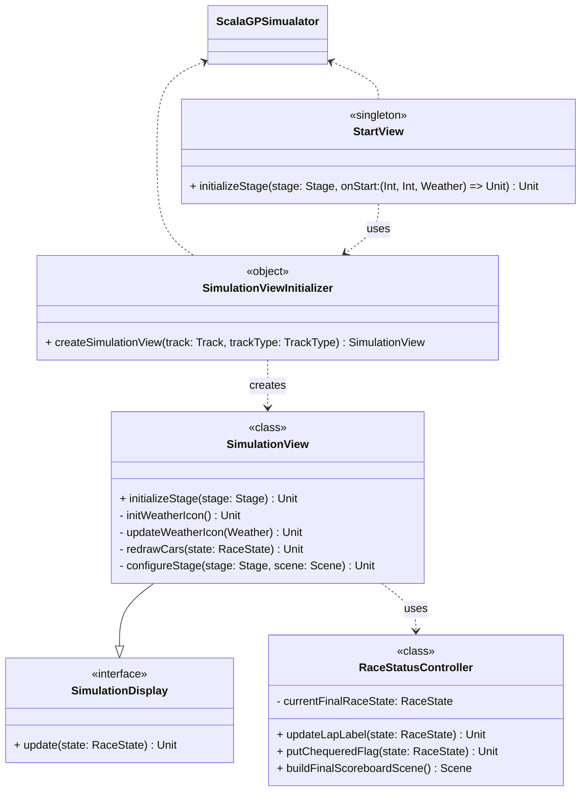

# View Initializer
This part was completely designed by Ines Fraccalvieri.

This part of the system focuses on **initializing, displaying, and controlling the simulation’s visual layer**.  
It forms the **entry point and presentation control layer** of the application.

---

### Flow of Control

Everything begins in **`ScalaGPSimulator`**, which extends **`JFXApp`** and serves as the entry point of the application.
- `ScalaGPSimulator` first **displays the `StartView`, allowing the user to choose simulation parameters (e.g., number of laps, cars, weather conditions).
- Once the user selects the parameters, `StartView` returns these values to `ScalaGPSimulator`, which then forwards them to `SimulationViewInitializer`. The initializer creates and configures a `SimulationView`, injecting all required dependencies to prepare the simulation for display.
- Finally, the `SimulationView` is shown, and the simulation loop begins, updating the view via the `SimulationDisplay` interface.

---

### Components

### StartView

Displays the **initial simulation setup interface**. Prepares the starting screen and triggers the `onStart` callback with simulation parameters (laps, participants, weather) that are chose by the user.

---

### SimulationView
Primary class responsible for displaying the live simulation. It builds and configures the stage, manages weather icons and car rendering, and works with `RaceStatusController` to keep race progress and results updated in real time.

---

### SimulationDisplay
A simple interface defining the update method. It ensures any simulation view can react to state changes without depending on the simulation’s internal logic.

---

### SimulationViewInitializer
Factory object that assembles a complete `SimulationView`. It injects necessary dependencies such as `RaceStatusController` and preconfigures UI elements like lap counters and scoreboard buttons, centralizing setup in one place.

---

### RaceStatusController
Manages race status display, including lap count updates, chequered flag handling, and building the final scoreboard view.