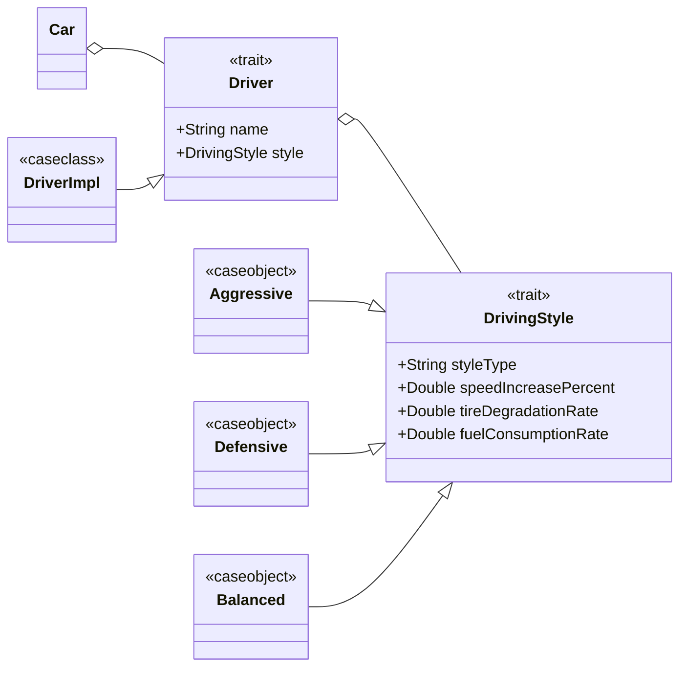

## Driver and Driving Style Implementation

## Driver and Driving Style Modules

The `DriverModule` and `DrivingStyleModule` work together to define the drivers and their behaviour in the racing simulation. Both `Driver` and `DrivingStyle` are created as Scala traits. This means they set clear rules for what a driver or driving style must have, but they do not give the exact implementation. This design makes it possible to use different implementations without changing the rest of the code.

The creation of drivers is done in the `Driver` companion object, which acts like a factory. It uses the `apply` method to check (`require`) that the driver’s name and style are valid before creating the object. The actual driver is stored as an immutable case class (`DriverImpl`). This means that after the driver is created, its data cannot be changed, and equality is checked by value, not by reference.

Driving styles are made as singleton case objects: `Aggressive`, `Defensive`, and `Balanced`. Because they are singletons, there is only one instance of each style in the program. This makes them easier to compare and avoids creating the same style many times. The `DrivingStyle` companion object works as a factory and also as an extractor. It can create a style by name and also gives quick methods to get the predefined styles.

The `DriverGenerator` object contains a list of predefined drivers, each with a specific style. This uses the Flyweight pattern by reusing the same immutable styles and drivers instead of creating new ones every time.

In general, the design follows important Scala ideas such as **immutability**, **separation of concerns**, and using **companion objects** for safe object creation. It also keeps the driver’s identity separate from their driving behaviour, which makes the system easier to extend and maintain.

The `CarModule` was implemented in the same way, following these principles to ensure consistent, immutable, and modular design.
