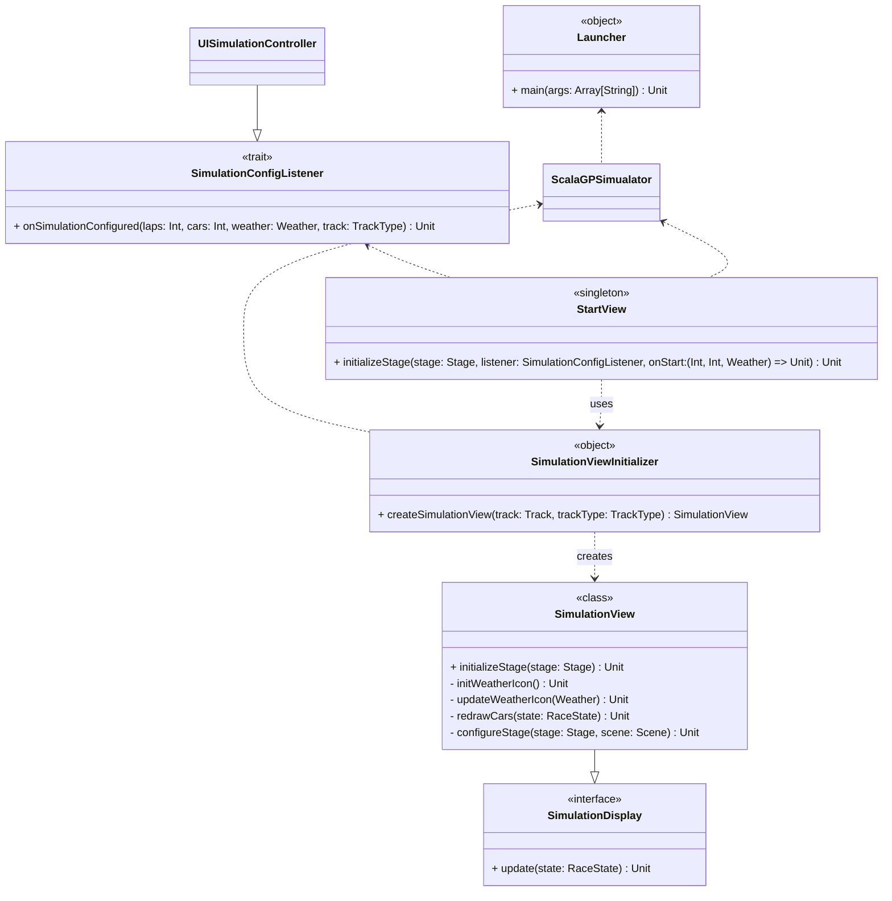

## Simulation Start

The main entry point of the **ScalaGP** program is the `ScalaGPSimulator` object, which extends `JFXApp3` from ScalaFX. This designates it as the primary JavaFX application, responsible for creating the main window (`Stage`) and managing the overall program startup and race simulation launch.

### Application Startup
When the program starts, the JavaFX runtime calls the `start()` method. This method creates the main application window (`PrimaryStage`) and calls `showStartPage()` to show the first screen where the user can configure the race.

### Start Screen and Configuration
The start screen is made by the `StartView` singleton.  
To work, it needs:
- The main `Stage`
- `SimulationConfigListener`: a trait defining actions after configuration (laps, cars, weather, track). Implemented by UISimulationController, it connects the UI with the race logic.
- An `onStart` callback that runs when the user chooses the track and starts the race

### From Configuration to Simulation
When the user presses start, the `onStart` callback is called. This uses `SimulationViewInitializer` to create a `SimulationView` for the chosen track.  
The `SimulationView`:
- Prepares the race screen
- Draws the cars and track
- Updates the weather icons
- Updates the screen when the race state changes

After the view is created, it is sent to the `UISimulationController` using `setDisplay()`, so the controller can control the UI during the race. Then, `view.initializeStage(stage)` replaces the start screen with the live race view.

#### Benefits

- **Divides** view from controller logic.
- Allows **flexible** controller swapping.
- Ensures **clear, asynchronous** data flow.

This pattern keeps user input handling and simulation initialization separate and organized.

### Design Notes
This design uses a **clear separation of responsibilities**:
- `ScalaGPSimulator` controls the main flow (start and switching screens)
- `StartView` manages the start screen
- `SimulationViewInitializer` creates the simulation view
- `UISimulationController` connects the UI with the race logic

This structure makes the code easier to maintain, because each part does one job. It also makes it easier to add new features, since the main parts of the program are separate and only communicate through clear interfaces.
