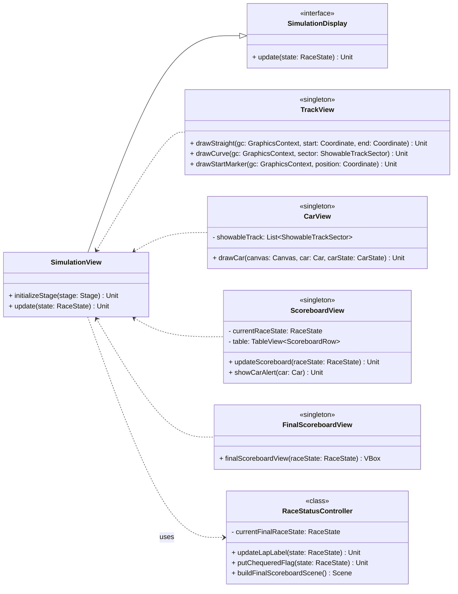

## SimulationView and RaceStatusController



The `SimulationView` in ScalaGP employs **separation of concerns** by isolating UI rendering from race logic. It uses two **ScalaFX Canvas** layers: one static for the track and one dynamic for cars, allowing efficient redraws each update cycle.

UI layout construction is modular via builder objects (`TopBarBuilder`, `WeatherBoxBuilder`, `MainContentBuilder`), promoting **code reuse** and clean separation of layout concerns. The use of **immutable UI components** like `VBox` and `HBox` aligns with functional UI design principles.

The view updates occur on the JavaFX thread through `Platform.runLater()`, ensuring **thread safety** during asynchronous UI refreshes.

```scala
 override def update(state: RaceState): Unit =
  import scalafx.application.Platform
  Platform.runLater(() =>
    raceStatusController.updateLapLabel(state)
    updateWeatherIcon(state.weather)
    redrawCars(state)
    ScoreboardView.updateScoreboard(state)
    raceStatusController.putChequeredFlag(state)
  )
```
The architecture follows the **Model-View-Controller (MVC)** pattern:
- **Model:** Contains immutable `RaceState`.
- **View:** `SimulationView` and singletons (`CarView`, `ScoreboardView`, `TrackView`) handle rendering.
- **Controller:** `RaceStatusController` manages race-specific UI logic (lap label, chequered flag).

Key design patterns include:
- **Singleton Pattern:** Used for shared views to maintain single instances, reducing memory footprint and synchronization complexity.
- **Factory and Builder Patterns:** UI builders create composite components, supporting scalability and easy modifications.
- **Interface Segregation:** `SimulationDisplay` interface ensures views implement only necessary methods, increasing modularity.

The code adheres to **SOLID principles**:
- **Single Responsibility Principle (SRP):** Each class/object has a focused responsibility.
- **Open/Closed Principle (OCP):** Easily extendable for new track types or weather conditions without changing existing code.
- **Liskov Substitution Principle (LSP):** `SimulationView` implements `SimulationDisplay`, allowing interchangeable view implementations.
- **Interface Segregation Principle (ISP):** Interfaces like `SimulationDisplay` are minimal and focused, avoiding forcing classes to implement unused methods.
- **Dependency Inversion Principle (DIP):** `SimulationView` depends on the `SimulationDisplay` interface, and the controller communicates with views through defined interfaces.

This design uses both **object-oriented** and **functional paradigms**, with immutability and composability ensuring maintainability and thread-safe UI updates. Overall, the system is flexible and prepared for future extensions.
