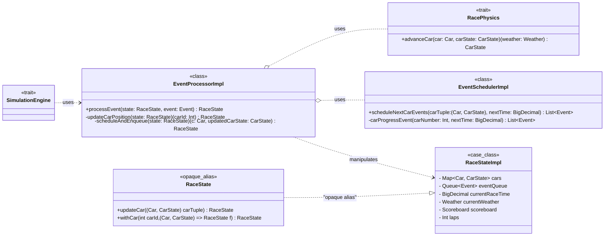

> NOTE: the diagram shows partial methods for each entity for demonstration purposes explained below.

## EventProcessorImpl

Implements `EventProcessor` to process race events.
The core method is `processEvent` which takes the current race state and an event, and returns an updated race state.
Based on the Event type the proper acton is taken to produce a new `RaceState` (which is not done directly by
`EventProcessor` but by `RaceState`'s extension methods).

For example if `CarProgress` type of `Event` is selected, `EventProcessor` will select `updateCarPosition()`

```scala
private def updateCarPosition(state: RaceState)(carId: Int): RaceState =
  state.withCar(carId)((car, carState) =>
    if (!carState.hasCompletedRace(state.laps) && !carState.isOutOfFuel)
      val updatedCarState = Physics.advanceCar(car, carState)(state.weather)
      scheduleAndEnqueue(state.updateCar((car, updatedCarState)))(car, updatedCarState)
    else state
  )
```

This is the main method which make the `Car`s move, to make it simple. Here is evidenced how `RacePhysics` is used (
injected upon creation). Also `scheduleAndEnqueue` will internally refer to `EventScheduler` to schedule future events
based on the new state produced:

```scala

private def scheduleAndEnqueue(state: RaceState)(c: Car, updatedCarState: CarState): RaceState =
  val events = Scheduler.scheduleNextCarEvents((c, updatedCarState), state.raceTime)
    [...]

```

---

## EventSchedulerImpl

Implementation of `EventScheduler`. Responsible for scheduling future events for cars and weather.
Key method: `scheduleNextCarEvents` decides what events to enqueue next based on the car's current state:

- Requests pit stops if out of fuel or tires need changing.
- Moves cars through track sectors.
- Otherwise, schedules a simple progress update. To continue the example from above, after calling
  `scheduleNextCarEvents`, internally this function will simply list a new `CarProgressEvent` at `currentTime + 1`

It also schedules weather change events with `scheduleNextWeatherEvent` as per the trait it implements.

---

## RacePhysics and RacePhysicsImpl

The method `advanceCar` takes a car and its state, along with current weather, and returns a new `CarState` (by
calculating new car progress and speed).

```scala

override def advanceCar(car: Car, carState: CarState)(weather: Weather): CarState =
  carState.withUpdatedState(
    speed = calculateNewSpeed(car, carState)(carState.currentSector, weather),
    fuelConsumed = getConsumedFuel(car),
    degradeIncrease = getTireDegradeIncrease(car)(weather),
    newProgress = calculateNewProgress(car, carState)(carState.currentSector, weather),
    tire = carState.tire,
    currentLaps = carState.currentLaps,
    currentSector = carState.currentSector

```

---

## RaceState

`RaceState` is an opaque alias. As said in [Detail Design](../../4_detailed_design/model/vuksan/simulation.md#racestate)
it represents the entire state of the race simulation.

### RaceStateImpl

Concrete implementation of the `RaceState`.
It holds:

- `cars`: a `Map` of all cars and their `CarState`s.
- `eventQueue`: a `Queue` of scheduled events to process, which is also sorted by `Event` `timeStamp`.
- `currentRaceTime`: current time as in logical steps.
- `currentWeather`: current `Weather` in the race.
- `scoreboard`: scores and rankings.
- `laps`: number of laps of the race.

This is what `RaceState` wraps and manipulates.

---