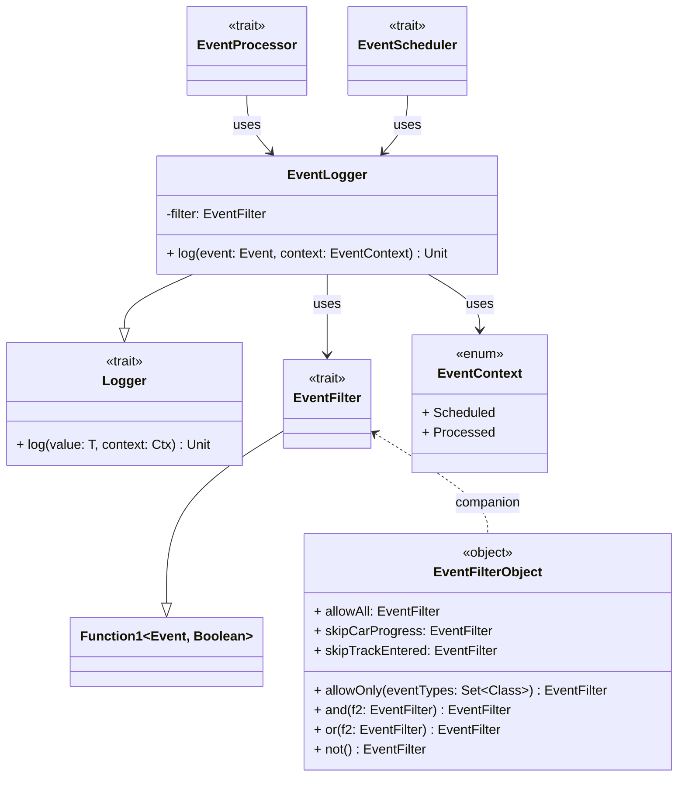

---

## Logger

A **generic** logging interface parameterized by two types:

- `T`: The type of values to be logged (e.g., `Event`).
- `Ctx`: The context in which the value is logged (e.g., `EventContext`).

It encapsulates generic logging operations such as the main one:
`log(value: T, context: Ctx)`

This trait is generic and does not depend on specific event types. It was designed mainly to support logging
for whatever entity in the domain model.

---

## EventContext

An **enum** describing the **context** of logging:

- `Scheduled` : Event is planned for future execution.
- `Processed` : Event has already been executed.

It is used by `EventLogger` to add semantic meaning to log messages.

---

## EventLogger

An implementation of `Logger` for `Event`s with a logging context (`EventContext`).

It will format events based on the `EventContext` provided when calling `log`.

`EventProcessor` and `EventScheduler` will use this object whenever they process or schedule `Event`s.

---

## EventFilter

A **predicate** that decides whether an `Event` should be logged.

In fact, this trait extends the type `Function1[Event, Boolean]`.

As it is easy to understand, it simply allows selective logging of events by type or other criteria.

---

## EventFilter Object

A **companion object** for `EventFilter` containing:

- Predefined filters (more can be easily defined):
    - `allowAll`
    - `skipCarProgress`
    - `skipTrackEntered`
- A method that allows to explicitly declare what `Event`s to show:
    - `allowOnly(Set[Class[_ <: Event]])`
- Extension methods for composition:
    - `and`, `or`, `not`

### An easy way to filter events

When instantiating an `EventLogger`, `EventFilter`'s can be composed in a idiomatic and functional way. Here is an
example:

```scala
val filteringOptions: EventFilter = EventFilter.skipCarProgress.and(EventFilter.skipTrackEntered).or(...) 

val eventLogger: Logger[Event, EventContext] = EventLogger(filteringOptions)

```

In our case, EventLogger takes place inside `SimulationAssembler` as briefly mentioned
in [Detailed Design](../../4_detailed_design/controller/controller.md#simulationassembler)


---
