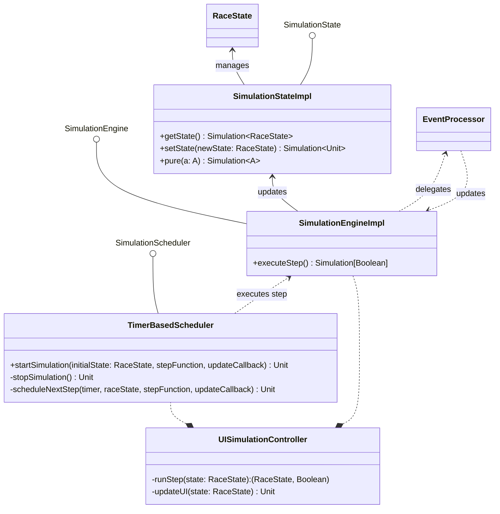

## SimulationEngineImpl

`SimulationEngineImpl` is the concrete engine that manipulates simulation state according to defined rules.
This class is purely focused on simulation logic, without timing or UI logic.

In this class the `executeStep()` method advances the simulation by exactly one logical time step.
It deserves attention, because of its monadic for-comprehension over the `Simulation` monad.

```scala
def executeStep(): Simulation[Boolean] =
  for
    currentState <- StateManager.getState
    (eventsToProcess, dequeuedState) = currentState.dequeueAllAtCurrentTime(currentState.raceTime)
    _ <- StateManager.setState(dequeuedState.advanceTime(logicalTimeStep))
    queueNotEmpty <- processEvents(eventsToProcess)
    nextState <- StateManager.getState
  yield queueNotEmpty && !nextState.isRaceFinished
```

Or in other words:

1. **Fetch current state** from the `SimulationState` manager.
2. **Dequeue events** scheduled for the current simulation time.
3. **Advance simulation time** by `logicalTimeStep`.
4. **Process events**:
    - Apply each event to the current state using the `EventProcessor`.
    - Update the simulation state after each event.
5. **Decide continuation**:
    - Continue if there are still events to process **and** the race is not finished.

This structure allows sequential composition of stateful operations while keeping side effects and
state transitions explicit and controlled.

---

## SimulationState

The `SimulationState` trait provides a functional interface for managing simulation state using the `State` monad from
Cats. It exposes the following key operations:

- `getState`: Reads the current `RaceState`.
- `setState`: Updates the simulation state with a new `RaceState`.
- `pure`: Lifts a pure value into the monadic context without modifying the state.

Each simulation step is represented as a `Simulation[A]`—an alias for `State[RaceState, A]`—which models computations
that carry and transform the immutable `RaceState` throughout the simulation lifecycle. This monadic design allows for
clear sequencing of state-dependent operations within a purely functional paradigm.

> Note: Initially, the `State` monad was implemented manually by defining `flatMap` and `map` methods to enable monadic
behavior. However, this approach was not stack safe, causing stack overflows during deep recursive state transformations
common in continuous simulation steps. To address this, the Cats library’s `State` monad was adopted, as it provides a
stack-safe implementation using a trampoline technique, ensuring efficient and safe handling of extensive recursive
computations without exhausting the call stack.

---

## EventProcessor

See [EventProcessor](./event_processing.md#eventprocessor)

---

## TimerBasedScheduler

`TimerBasedScheduler` is a concrete implementation of `SimulationScheduler` that triggers simulation steps at fixed time
intervals, ensuring the execution proceeds on a background thread without blocking the UI rendering thread.
It schedules the next simulation step after a specified delay (`x` milliseconds), invoking the step function with the
latest `RaceState` and repeating the process until completion.

The introduction of this scheduler is motivated by the requirement for real-time, GUI-driven simulation. Without such
timing control, the simulation would execute instantaneously through recursive calls, as in the CLI-based
implementation (see `CLISimulationController`), resulting in an unrealistic user experience.

---

## UISimulationController

`UISimulationController` is the concrete, **UI-aware** implementation of `SimulationController`. It coordinates between
the simulation core and the presentation layer.

Apart from starting the simulation, it acts as a bridge between `SimulationEngine` and the view. More specifically it
injects directly into
the `SimulationScheduler` what step needs to be executed with `runStep()` (in this case `executeStep()` will be called)
and what callback to execute for the
UI to be updated.

> NOTE: `UISimulationController` defines an overloaded variant of the `loop()` method from the interface.

---

## **Interaction Summary**

- **TimerBasedScheduler** controls when simulation steps are executed.
- **SimulationEngineImpl** runs a step, processes events via **EventProcessor**, and updates the state through *
  *SimulationStateImpl**.
- **SimulationStateImpl** maintains the authoritative **RaceState**.
- **UISimulationController** uses the scheduler and engine to trigger updates and reflects the latest state in the UI.
- **EventProcessor** can influence the simulation engine by injecting state changes derived from events.