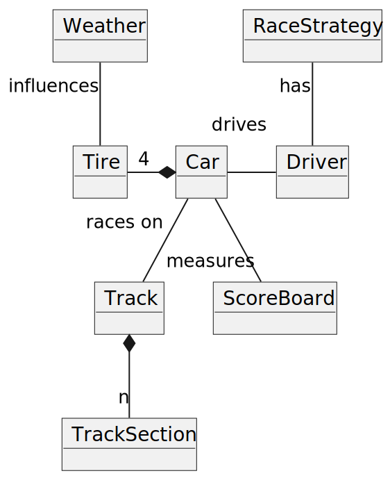

# Requirement specification

## 1\. **Business Requirements**

The project involves creating a simplified simulation of a car race (F1 style), with emphasis on strategy, weather conditions, tire management, and driver behavior. The main objective is to offer the user an **interactive or simulation platform** where they can:

*   Simulate races with variable road and weather conditions
*   Observe the race's evolution based on strategies and parameters
*   Analyze the results through a scoreboard

  

The **main objectives** of the project are:

*   to consolidate the mastery of advanced programming concepts in Scala, such as:
    *   mixins.
    *   monads.
    *   ADTs (Algebraic Data Types), objects, and modules.
    *   possibly exploiting programming patterns.
*   to exploit the pure Scala programming paradigm (immutability).
*   to be SOLID-compliant.
*   to adopt Test Driven Development (TDD) during development.
*   to experiment with techniques and methods for managing the development process, such as GitFlow, GitHub Actions, CI/CD, etc.
*   to complete the project in compliance with the exam specifications.

  

The aforementioned business requirements will be considered satisfied if:

*   advanced Scala elements have been incorporated into the project.
*   each feature is verifiable through specific tests created following TDD.
*   work on the repository has been divided into different branches, with the main branch containing only stable versions → use of GitFlow.
*   all workflows for CI/CD have been implemented.
*   the project delivery occurred by the set deadline.

  

* * *

## 2. **Domain Model**
  

Main entities of the domain:

*   **TrackSection:** Represents a segment of the track. Each section can have specific characteristics that affect vehicle performance.
    *   Curvature.
    *   Maximum speed.
    *   Average speed.
    *   Average grip.
*   **Track:** Represents the entire race circuit.
    *   Composed by n TrackSections.
    *   Pit stop point.
    *   Start/finish line.
*   **Car:** Simulates a racing car, with generic and dynamic attributes.
    *   Car with common basic feature (car weight).
    *   Driver associated with a driving style.
    *   Dynamic parameters: fuel and tires
*   **Driver:** The car's driver. Directly influences driving style and race management. Chooses the type of strategy to adopt for the race.
*   **Tire:** Represents a type of tire with performance and behavioral characteristics.
    *   Types: soft, medium, hard, wet
    *   Parameters: initial grip and degradation
*   **Weather:** Represents the weather conditions of the race, affecting the track and strategies.
    *   Conditions: sunny, rainy, foggy
    *   Impact on grip, tire wear and speed
*   **RaceStrategy:** Defines the race strategy adopted by the team/driver
    *   Aggressive
    *   Conservative
    *   Intermediate
*   **Scoreboard**: Result tracking system during and after a race. It allows monitoring the progress of the drivers.

* * *

## 3\. **Functional Requirements**
### 3.1 User Requirements

The user can:

  

*   Start, pause, and stop the simulation.
*   Display the race in real-time.
*   View the results (live scoreboard or final result).
*   Set the weather conditions.
*   Set the number of laps.

  
#### 3.1.1 Optional
  

*   The user can select the track.
*   Choose the race strategy for the driver (aggressive, intermediate, conservative).
*   Set advanced parameters (car, tires, initial fuel).

  
### 3.2 System Requirements

The system must:

*   Simulate the behavior of each driver on each section of the track.
*   Apply the rules of simplified physics:
    *   Speed and acceleration based on section, weather, vehicle parameters, and strategy.
    *   Calculation of tire wear.
    *   Calculation of rem fuel.
*   Manage pit stops based on the chosen strategy.
*   Display a summary real-time scoreboard, which must calculate for each driver in each lap:
    *   Lap time.
    *   Best lap.
    *   Gap from the leading driver.

* * *

## 4. **Non-Functional Requirements (to be reviewed)**

*   **Performance**: simulation must be executable **maintaining a stable and consistent framerate around 60 FPS on a machine with minimum requirements of 4GB of RAM, Dual Core CPU at 2.8 GHz**.
*   **Usability**: simple interface for setting parameters and visualization.
*   **Scalability**: ease of adding new tracks, weather, tires, or drivers in the future.
*   **Modularity**: each component (physics, driver, track) is separate and replaceable.

  

* * *

## 5\. **Implementation Requirements**

1. Use Scala as the programming language.
2. Use Git as the VCS.
3. Documentation (Scaladoc) must be present for every public API.